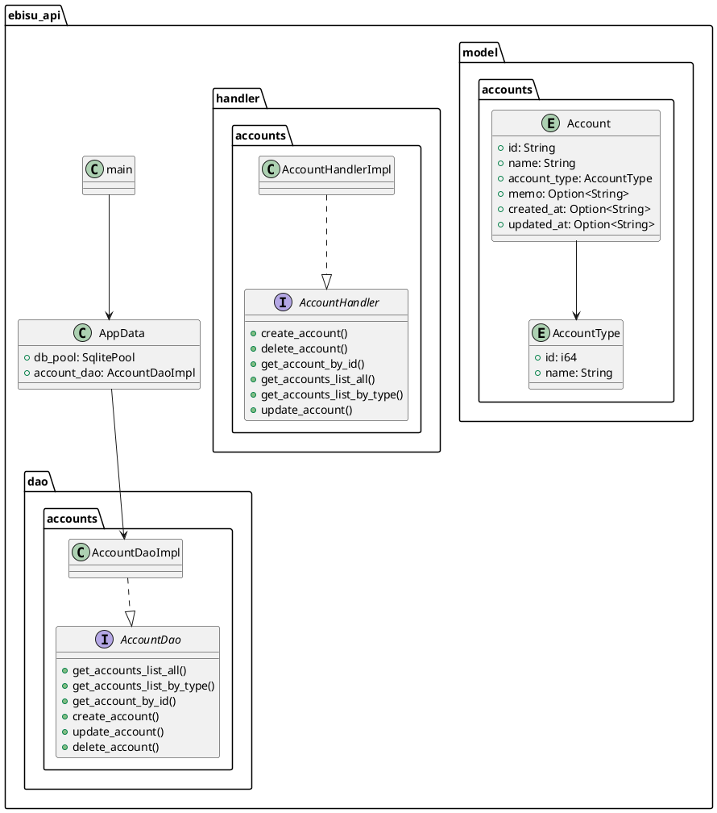

```plantuml
@startuml
' Ebisu API クラス図 (src配下)

package ebisu_api {
  ' モデル
  package model {
    package accounts {
      entity AccountType{
        +id: i64
        +name: String
      }

      entity Account {
        +id: String
        +name: String
        +account_type: AccountType
        +memo: Option<String>
        +created_at: Option<String>
        +updated_at: Option<String>
      }
    }
  }

  ' DAO
  package dao {
    package accounts {
      interface AccountDao {
        +get_accounts_list_all()
        +get_accounts_list_by_type()
        +get_account_by_id()
        +create_account()
        +update_account()
        +delete_account()
      }

      class AccountDaoImpl
      AccountDaoImpl ..|> AccountDao
    }
  }

  ' Handler
  package handler {
    package accounts {
      interface AccountHandler {
        +create_account()
        +delete_account()
        +get_account_by_id()
        +get_accounts_list_all()
        +get_accounts_list_by_type()
        +update_account()
      }

      class AccountHandlerImpl
      AccountHandlerImpl ..|> AccountHandler
    }
  }

  ' AppData (DI用)
  class AppData {
    +db_pool: SqlitePool
    +account_dao: AccountDaoImpl
  }

  ' 関連
  Account --> AccountType
  AppData --> AccountDaoImpl

  main --> AppData
}

@enduml
```