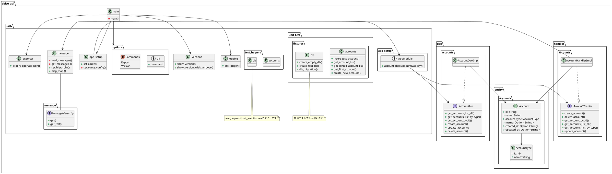

```plantuml
@startuml
' Ebisu API クラス図 (src配下)

package ebisu_api {
  ' エンティティ
  package entity {
    package accounts {
      class AccountType {
        +id: i64
        +name: String
      }

      class Account {
        +id: String
        +name: String
        +account_type: AccountType
        +memo: Option<String>
        +created_at: Option<String>
        +updated_at: Option<String>
      }
    }
  }

  ' DAO
  package dao {
    package accounts {
      interface AccountDao {
        +get_accounts_list_all()
        +get_accounts_list_by_type()
        +get_account_by_id()
        +create_account()
        +update_account()
        +delete_account()
      }

      class AccountDaoImpl
      AccountDaoImpl ..|> AccountDao
    }
  }

  ' Handler
  package handler {
    package accounts {
      interface AccountHandler {
        +create_account()
        +delete_account()
        +get_account_by_id()
        +get_accounts_list_all()
        +get_accounts_list_by_type()
        +update_account()
      }

      class AccountHandlerImpl
      AccountHandlerImpl ..|> AccountHandler
    }
  }

  package utils {
    package unit_test {
      package fixtures {
        class accounts {
          +insert_test_account()
          +get_account_list()
          +get_sorted_account_list()
          +get_first_account()
          +create_new_account()
        }
        class db {
          +create_empty_db()
          +create_test_db()
          +db_migration()
        }
      }
    }
    note bottom: 単体テストでしか使わない
    package test_helpers {
      class accounts
      class db
    }
    note bottom: test_helpersはunit_test::fixturesのエイリアス
    package app_setup as AppSetupModule {
      ' AppModule (DI用)
      struct AppModule {
        +account_dao: AccountDao (dyn)
      }
    }
    class app_setup {
      +set_route()
      -set_route_config()
    }
    app_setup -> AppModule

    class exporter {
      +export_openapi_json()
    }
    class logging {
      +init_logger()
    }
    package message as MessagePkg {
      interface MessageHierarchy {
        +get()
        +get_fmt()
      }
    }
    class message {
      -load_messages()
      -get_messages_()
      +set_hierarchy()
      +msg_map!()
    }
    message -- MessageHierarchy

    package options {
      struct Cli {
        +command
      }
      enum Commands {
        Export
        Version
      }
    }
    class versions {
      +show_version()
      +show_version_with_verbose()
    }
  }

  class main {
    -main()
  }

  ' 関連
  Account --> AccountType
  AccountHandlerImpl --> Account
  AccountDaoImpl --> Account
  AccountHandlerImpl --> message

  AppModule --> AccountHandler
  AppModule --> AccountDao
  main --> app_setup
  main --> exporter
  main --> options
  main --> logging
  main --> versions

}

@enduml
```